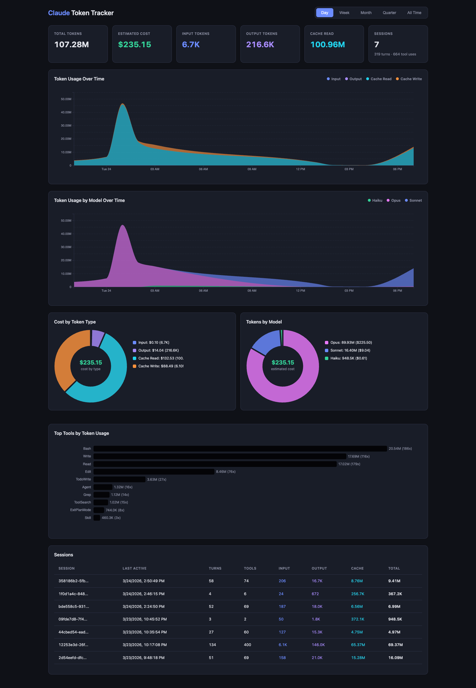

# token-tracker

Track Claude Code token usage in a local SQLite database and visualize it with an interactive D3.js dashboard that auto-starts with the plugin.



## How It Works

The plugin uses a **two-process architecture** similar to claude-mem:

- **STDIO MCP server** (`mcp-server.py`) — ephemeral, per-session. Claude Code starts it via `.mcp.json`. It spawns the worker daemon if not already running, registers MCP tools, and proxies tool calls to the worker via HTTP.
- **Worker daemon** (`worker.py`) — persistent, survives across Claude Code session restarts. Owns the SQLite database, serves the D3.js dashboard, and exposes the ingest API on a fixed port (`47700` by default, configurable via `TOKEN_TRACKER_PORT` env var). Managed via a PID file to prevent duplicates.

A **Stop hook** fires after every assistant turn, parses the session transcript to extract token usage (input, output, cache read, cache creation), and POSTs the events to the worker's ingest endpoint.

## Quick Start

1. **Install the plugin** from the Arcalea marketplace — everything starts automatically.
2. **Ask Claude** "show me my token usage" or "open the token dashboard" — it will use the MCP tools to give you the URL.
3. **Open the dashboard** in your browser to see interactive charts, session tables, and drill-down views.

## Dashboard Features

- **Summary cards** — Total tokens, estimated cost, input/output/cache breakdowns, session counts
- **Time-series chart** — Stacked area chart filterable by day (default), week, month, quarter, all-time
- **Token type donut** — Visual breakdown of input vs output vs cache
- **Top tools chart** — Which tools consume the most tokens
- **Sessions table** — Click to expand and see individual turn/tool events
- **Auto-refresh** — Updates every 30 seconds

## Plugin Structure

```
token-tracker/
├── .claude-plugin/plugin.json   # Plugin metadata
├── .mcp.json                    # STDIO MCP server definition (auto-starts)
├── hooks/hooks.json             # Stop hook for transcript parsing
├── scripts/
│   ├── mcp-server.py            # Ephemeral STDIO MCP proxy (spawns worker)
│   ├── worker.py                # Persistent daemon (DB + HTTP dashboard)
│   └── token_tracker.py         # Stop hook (thin HTTP client)
├── assets/
│   └── dashboard.html           # D3.js dashboard
├── skills/token-tracker/
│   └── SKILL.md                 # Skill instructions for Claude
└── README.md
```

## Prerequisites

- **Python 3.9+** (compatible with macOS system Python)
- **fastapi + uvicorn** — auto-installed into a venv at `~/.claude/token-tracker/venv/`
